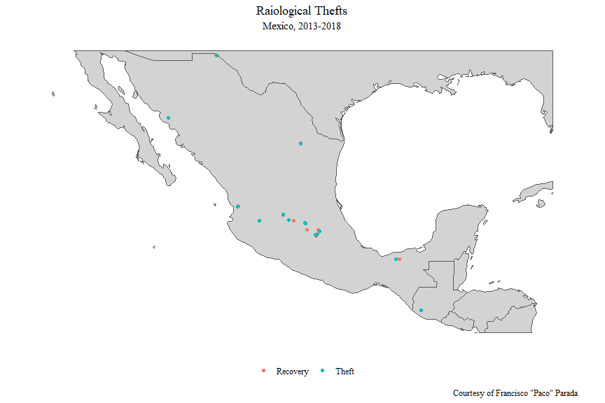
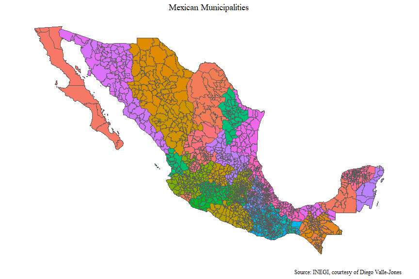
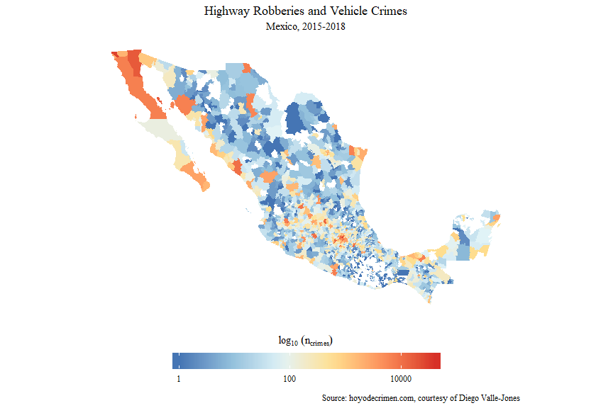

Data Carpentry
================

``` r
library(tidyverse)
library(sf)
library(geojsonio)
library(mxmaps)
library(lubridate)
library(knitr)
```

``` r
prettify <- function(df, rowstart = 1, rowstop = 3, ...){
  df %>% 
    slice(rowstart:rowstop) %>%
    mutate_if(is.Date, as.character) %>%
    mutate_if(is.difftime, as.character) %>%
    mutate_if(is.character, replace_na, "") %>% 
    kable(format = "markdown", ...)
}
```

``` r
base_geom_sf <- maps::map(fill = TRUE, plot = FALSE) %>% 
  st_as_sf() %>%
  as_tibble() %>%
  st_as_sf() %>% 
  st_crop(xmin = -121, ymin = 13, xmax = -82, ymax = 32)
```

Radiological Theft Events
=========================

The manual cataloguing of radiological theft events was only possible through the persistent efforts of [Francisco "Paco" Parada](https://twitter.com/paco_parada).

``` r
raw_events_df <- read_csv("data/raw_events.csv")
```

Flat Data
=========

Crimes
------

This incredibly useful Mexican crime data was made possible by [Diego Valle](https://twitter.com/diegovalle). It can be found [here](https://elcri.men/en/datos.html).

``` r
temp_file <- tempfile(fileext = ".gz")
download.file("https://elcri.men/data/nm-fuero-comun-municipios.csv.gz",
              destfile = temp_file)
```

``` r
crimes_df <- read_csv(gzfile(temp_file)) %>% 
  mutate(count = as.numeric(count)) %>%
  filter(count != 0) %>%
  distinct() %>% 
  filter(subtipo %in% c("ROBO DE VEHÍCULO AUTOMOTOR",
                        "ROBO EN TRANSPORTE INDIVIDUAL",
                        "ROBO EN TRANSPORTE PÚBLICO COLECTIVO",
                        "ROBO EN TRANSPORTE PÚBLICO INDIVIDUAL",
                        "ROBO A TRANSPORTISTA"  )) %>%
  mutate(INEGI = str_mxmunicipio(state_code, mun_code)) %>%
  mutate(date = date %>%
           paste0( "-01") %>%
           as.Date(format = "%Y-%m-%d")
         ) %>%
  select(date, INEGI, tipo, subtipo, modalidad, count) %>% 
  distinct()
```

``` r
crimes_df %>% 
  prettify()
```

<table style="width:100%;">
<colgroup>
<col width="11%" />
<col width="6%" />
<col width="5%" />
<col width="27%" />
<col width="40%" />
<col width="6%" />
</colgroup>
<thead>
<tr class="header">
<th align="left">date</th>
<th align="left">INEGI</th>
<th align="left">tipo</th>
<th align="left">subtipo</th>
<th align="left">modalidad</th>
<th align="right">count</th>
</tr>
</thead>
<tbody>
<tr class="odd">
<td align="left">2015-01-01</td>
<td align="left">01001</td>
<td align="left">ROBO</td>
<td align="left">ROBO DE VEHÍCULO AUTOMOTOR</td>
<td align="left">ROBO DE COCHE DE 4 RUEDAS CON VIOLENCIA</td>
<td align="right">4</td>
</tr>
<tr class="even">
<td align="left">2015-01-01</td>
<td align="left">01001</td>
<td align="left">ROBO</td>
<td align="left">ROBO DE VEHÍCULO AUTOMOTOR</td>
<td align="left">ROBO DE COCHE DE 4 RUEDAS SIN VIOLENCIA</td>
<td align="right">114</td>
</tr>
<tr class="odd">
<td align="left">2015-01-01</td>
<td align="left">01003</td>
<td align="left">ROBO</td>
<td align="left">ROBO DE VEHÍCULO AUTOMOTOR</td>
<td align="left">ROBO DE COCHE DE 4 RUEDAS SIN VIOLENCIA</td>
<td align="right">3</td>
</tr>
</tbody>
</table>

Demographics
------------

``` r
demographics_df <- df_mxmunicipio %>% 
  as_tibble() %>% 
  mutate(INEGI = str_mxmunicipio(state_code, municipio_code)) %>% 
  select(INEGI, municipio_name, pop, pop_male, pop_female,
         metro_area) %>% 
  mutate(is_metro = if_else(is.na(metro_area), FALSE, TRUE)) %>% 
  distinct()
```

``` r
demographics_df %>% 
  prettify()
```

| INEGI | municipio\_name |     pop|  pop\_male|  pop\_female| metro\_area    | is\_metro |
|:------|:----------------|-------:|----------:|------------:|:---------------|:----------|
| 01001 | Aguascalientes  |  877190|     425731|       451459| Aguascalientes | TRUE      |
| 01002 | Asientos        |   46464|      22745|        23719|                | FALSE     |
| 01003 | Calvillo        |   56048|      27298|        28750|                | FALSE     |

Spatial Data
============

Radiological Theft Geometries
-----------------------------

``` r
new_names <- list(
  timeUTC = "UTC -6",
  eventID = "EventID",
  location = "Location",
  date = "Dates",
  timeLocal = "localtimerobbery",
  daysToRecovery = "Reco_time",
  theftRecovery = "Event",
  reportNumber = "reportnum",
  licensee = "Licensee",
  lat = "Lat",
  long = "Long",
  distanceTheftRecovery = "distance",
  category = "Category",
  typeIEC = "Type_IEC",
  thesisGroup = "Thesis_grouping",
  source = "Source",
  isotope = "Isotope",
  sourceActivityCi = "Source Activity Ci",
  sourceActivityTBq = "Source Activity TBq",
  eventNature = "Nature of event"
)

events_sf <- raw_events_df %>% 
  rename(!!!new_names) %>%
  mutate(date = as.Date(date, format = "%d-%b-%y")) %>% 
  drop_na(long, lat) %>% 
  st_as_sf(coords = c("long", "lat"), crs = 4326)
```

``` r
events_sf %>% 
  select(date, timeUTC, timeLocal, theftRecovery,
         category, distanceTheftRecovery, geometry) %>% 
  prettify()
```

| date       | timeUTC  | timeLocal | theftRecovery |  category|  distanceTheftRecovery| geometry                  |
|:-----------|:---------|:----------|:--------------|---------:|----------------------:|:--------------------------|
| 2017-08-01 | 22:20:00 | 16:20:00  | Theft         |         4|              5.8464255| c(-100.314769, 25.738078) |
| 2017-08-02 | 02:50:00 | 20:50:00  | Recovery      |         4|              5.8464255| c(-100.304267, 25.78925)  |
| 2016-08-05 | 12:37:00 | 06:39:00  | Theft         |         4|              0.4356683| c(-109.9513, 27.470678)   |

``` r
ggplot() +
  geom_sf(data = base_geom_sf, fill = "lightgray") +
  geom_sf(data = events_sf,
          aes(color = theftRecovery),
          show.legend = "point") +
  guides(color = guide_legend(title = NULL)) +
  coord_sf(datum = NA) +
  theme_minimal() +
  theme(text = element_text("serif"),
        legend.position = "bottom", 
        plot.title = element_text(hjust = 0.5),
        plot.subtitle = element_text(hjust = 0.5)) +
  labs(title = "Raiological Thefts",
       subtitle = str_glue("Mexico, {year1}-{year2}", 
                           year1 = year(min(events_sf$date)),
                           year2 = year(max(events_sf$date))),
       caption = "Courtesy of Francisco \"Paco\" Parada")
```



``` r
write_rds(events_sf, "data/events_sf.rds")
```

Municipality Geometries
-----------------------

``` r
temp_dir <- tempdir()

write(RJSONIO::toJSON(mxmaps::mxmunicipio.topoJSON), 
      file.path(temp_dir, "mxmunicipio.topojson"))

# per https://gist.github.com/diegovalle/993cca843092bf8df692: crs = 4326
municipalities_sf <- read_sf(file.path(temp_dir, "mxmunicipio.topojson"),
                             stringsAsFactors = FALSE,
                             crs = 4326) %>%
  as_tibble() %>%
  rename(INEGI = id) %>% 
  st_as_sf()
```

``` r
ggplot() +
  geom_sf(data = municipalities_sf,
          aes(fill = INEGI),
          size = 0.01, show.legend = FALSE) +
  guides(color = guide_legend(title = NULL)) +
  coord_sf(datum = NA) +
  theme_minimal() +
  theme(text = element_text("serif"),
        plot.title = element_text(hjust = 0.5),
        plot.subtitle = element_text(hjust = 0.5)) +
  labs(title = "Mexican Municipalities",
       caption = "Source: INEGI, courtesy of Diego Valle-Jones")
```



``` r
write_rds(municipalities_sf, "data/municipalities_sf.rds")
```

Crime Geometries
================

``` r
crimes_sf <- municipalities_sf %>% 
  left_join(crimes_df) %>% 
  drop_na(date)
```

``` r
crimes_for_plot <- crimes_sf %>% 
  mutate(year = year(date)) %>% 
  st_transform(3857) %>% 
  st_buffer(0) %>% 
  group_by(INEGI) %>% 
  summarise(count = sum(count))

crimes_for_plot %>% 
  ggplot() +
  geom_sf(aes(fill = count),
          color = "transparent") +
  scale_fill_distiller(palette = "RdYlBu", trans = "log10") +
  guides(fill = guide_colorbar(
    title = expression(paste(log[10]~(n[crimes])), parse = TRUE),
    title.position = "top",
    title.hjust = 0.5,
    label.position = "bottom",
    barwidth = grid::unit(10, "cm"))
    ) +
  coord_sf(datum = NA) +
  theme_minimal() +
  theme(text = element_text("serif"),
        plot.title = element_text(hjust = 0.5),
        plot.subtitle = element_text(hjust = 0.5),
        legend.position = "bottom") +
  labs(title = "Highway Robberies and Vehicle Crimes", 
       subtitle = str_glue("Mexico, {year1}-{year2}", 
                           year1 = year(min(crimes_sf$date)),
                           year2 = year(max(crimes_sf$date))),
       caption = "Source: hoyodecrimen.com, courtesy of Diego Valle-Jones")
```



``` r
write_rds(crimes_sf, "data/crimes_sf.rds")
```

Reproducibility
===============

``` r
sess_info <- devtools::session_info()
```

Platform
--------

``` r
sess_info$platform %>% 
  unlist() %>%
  as.matrix() %>% 
  data.frame() %>% 
  rownames_to_column() %>% 
  `colnames<-`(c("setting", "value")) %>% 
  kable()
```

| setting  | value                        |
|:---------|:-----------------------------|
| version  | R version 3.5.0 (2018-04-23) |
| system   | x86\_64, mingw32             |
| ui       | RTerm                        |
| language | (EN)                         |
| collate  | English\_United States.1252  |
| tz       | America/Los\_Angeles         |
| date     | 2018-05-13                   |

Packages
--------

``` r
sess_info$packages %>% 
  kable()
```

| package      | \*  | version    | date       | source                                 |
|:-------------|:----|:-----------|:-----------|:---------------------------------------|
| assertthat   |     | 0.2.0      | 2017-04-11 | CRAN (R 3.5.0)                         |
| backports    |     | 1.1.2      | 2017-12-13 | CRAN (R 3.5.0)                         |
| base         | \*  | 3.5.0      | 2018-04-23 | local                                  |
| bindr        |     | 0.1.1      | 2018-03-13 | CRAN (R 3.5.0)                         |
| bindrcpp     | \*  | 0.2.2      | 2018-03-29 | CRAN (R 3.5.0)                         |
| broom        |     | 0.4.4      | 2018-03-29 | CRAN (R 3.5.0)                         |
| cellranger   |     | 1.1.0      | 2016-07-27 | CRAN (R 3.5.0)                         |
| class        |     | 7.3-14     | 2015-08-30 | CRAN (R 3.5.0)                         |
| classInt     |     | 0.2-3      | 2018-04-16 | CRAN (R 3.5.0)                         |
| cli          |     | 1.0.0      | 2017-11-05 | CRAN (R 3.5.0)                         |
| colorspace   |     | 1.3-2      | 2016-12-14 | CRAN (R 3.5.0)                         |
| compiler     |     | 3.5.0      | 2018-04-23 | local                                  |
| crayon       |     | 1.3.4      | 2017-09-16 | CRAN (R 3.5.0)                         |
| crosstalk    |     | 1.0.0      | 2016-12-21 | CRAN (R 3.5.0)                         |
| curl         |     | 3.2        | 2018-03-28 | CRAN (R 3.5.0)                         |
| datasets     | \*  | 3.5.0      | 2018-04-23 | local                                  |
| DBI          |     | 1.0.0      | 2018-05-02 | CRAN (R 3.5.0)                         |
| devtools     |     | 1.13.5     | 2018-02-18 | CRAN (R 3.5.0)                         |
| digest       |     | 0.6.15     | 2018-01-28 | CRAN (R 3.5.0)                         |
| dplyr        | \*  | 0.7.4      | 2017-09-28 | CRAN (R 3.5.0)                         |
| e1071        |     | 1.6-8      | 2017-02-02 | CRAN (R 3.5.0)                         |
| evaluate     |     | 0.10.1     | 2017-06-24 | CRAN (R 3.5.0)                         |
| forcats      | \*  | 0.3.0      | 2018-02-19 | CRAN (R 3.5.0)                         |
| foreign      |     | 0.8-70     | 2017-11-28 | CRAN (R 3.5.0)                         |
| geojson      |     | 0.2.0      | 2017-11-08 | CRAN (R 3.5.0)                         |
| geojsonio    | \*  | 0.6.0      | 2018-03-30 | CRAN (R 3.5.0)                         |
| ggplot2      | \*  | 2.2.1.9000 | 2018-05-11 | Github (<thomasp85/ggplot2@dfa0bc3>)   |
| glue         |     | 1.2.0      | 2017-10-29 | CRAN (R 3.5.0)                         |
| graphics     | \*  | 3.5.0      | 2018-04-23 | local                                  |
| grDevices    | \*  | 3.5.0      | 2018-04-23 | local                                  |
| grid         |     | 3.5.0      | 2018-04-23 | local                                  |
| gtable       |     | 0.2.0      | 2016-02-26 | CRAN (R 3.5.0)                         |
| haven        |     | 1.1.1      | 2018-01-18 | CRAN (R 3.5.0)                         |
| highr        |     | 0.6        | 2016-05-09 | CRAN (R 3.5.0)                         |
| hms          |     | 0.4.2      | 2018-03-10 | CRAN (R 3.5.0)                         |
| htmltools    |     | 0.3.6      | 2017-04-28 | CRAN (R 3.5.0)                         |
| htmlwidgets  |     | 1.2        | 2018-04-19 | CRAN (R 3.5.0)                         |
| httpuv       |     | 1.4.2      | 2018-05-03 | CRAN (R 3.5.0)                         |
| httr         |     | 1.3.1      | 2017-08-20 | CRAN (R 3.5.0)                         |
| inegiR       |     | 2.0.0      | 2018-03-30 | CRAN (R 3.5.0)                         |
| jqr          |     | 1.0.0      | 2017-09-28 | CRAN (R 3.5.0)                         |
| jsonlite     |     | 1.5        | 2017-06-01 | CRAN (R 3.5.0)                         |
| knitr        | \*  | 1.20.2     | 2018-04-28 | local                                  |
| later        |     | 0.7.2      | 2018-05-01 | CRAN (R 3.5.0)                         |
| lattice      |     | 0.20-35    | 2017-03-25 | CRAN (R 3.5.0)                         |
| lazyeval     |     | 0.2.1      | 2017-10-29 | CRAN (R 3.5.0)                         |
| leaflet      |     | 2.0.0.9000 | 2018-05-13 | Github (<rstudio/leaflet@c2f386f>)     |
| lubridate    | \*  | 1.7.4      | 2018-04-11 | CRAN (R 3.5.0)                         |
| magrittr     |     | 1.5        | 2014-11-22 | CRAN (R 3.5.0)                         |
| maps         |     | 3.3.0      | 2018-04-03 | CRAN (R 3.5.0)                         |
| maptools     |     | 0.9-2      | 2017-03-25 | CRAN (R 3.5.0)                         |
| memoise      |     | 1.1.0      | 2017-04-21 | CRAN (R 3.5.0)                         |
| methods      | \*  | 3.5.0      | 2018-04-23 | local                                  |
| mime         |     | 0.5        | 2016-07-07 | CRAN (R 3.5.0)                         |
| mnormt       |     | 1.5-5      | 2016-10-15 | CRAN (R 3.5.0)                         |
| modelr       |     | 0.1.1      | 2017-07-24 | CRAN (R 3.5.0)                         |
| munsell      |     | 0.4.3      | 2016-02-13 | CRAN (R 3.5.0)                         |
| mxmaps       | \*  | 0.5.2      | 2018-05-07 | Github (<diegovalle/mxmaps@5610912>)   |
| nlme         |     | 3.1-137    | 2018-04-07 | CRAN (R 3.5.0)                         |
| parallel     |     | 3.5.0      | 2018-04-23 | local                                  |
| pillar       |     | 1.2.2      | 2018-04-26 | CRAN (R 3.5.0)                         |
| pkgconfig    |     | 2.0.1      | 2017-03-21 | CRAN (R 3.5.0)                         |
| plyr         |     | 1.8.4      | 2016-06-08 | CRAN (R 3.5.0)                         |
| promises     |     | 1.0.1      | 2018-04-13 | CRAN (R 3.5.0)                         |
| psych        |     | 1.8.4      | 2018-05-06 | CRAN (R 3.5.0)                         |
| purrr        | \*  | 0.2.4      | 2017-10-18 | CRAN (R 3.5.0)                         |
| R6           |     | 2.2.2      | 2017-06-17 | CRAN (R 3.5.0)                         |
| RColorBrewer |     | 1.1-2      | 2014-12-07 | CRAN (R 3.5.0)                         |
| Rcpp         |     | 0.12.16    | 2018-03-13 | CRAN (R 3.5.0)                         |
| readr        | \*  | 1.1.1      | 2017-05-16 | CRAN (R 3.5.0)                         |
| readxl       |     | 1.1.0      | 2018-04-20 | CRAN (R 3.5.0)                         |
| reshape2     |     | 1.4.3      | 2017-12-11 | CRAN (R 3.5.0)                         |
| rgdal        |     | 1.2-20     | 2018-05-07 | CRAN (R 3.5.0)                         |
| rgeos        |     | 0.3-26     | 2017-10-31 | CRAN (R 3.5.0)                         |
| RJSONIO      |     | 1.3-0      | 2014-07-28 | CRAN (R 3.5.0)                         |
| rlang        |     | 0.2.0.9001 | 2018-05-11 | Github (<r-lib/rlang@ccdbd8b>)         |
| rmarkdown    |     | 1.9        | 2018-03-01 | CRAN (R 3.5.0)                         |
| RPostgreSQL  |     | 0.6-2      | 2017-06-24 | CRAN (R 3.5.0)                         |
| rprojroot    |     | 1.3-2      | 2018-01-03 | CRAN (R 3.5.0)                         |
| rstudioapi   |     | 0.7        | 2017-09-07 | CRAN (R 3.5.0)                         |
| rvest        |     | 0.3.2      | 2016-06-17 | CRAN (R 3.5.0)                         |
| scales       |     | 0.5.0.9000 | 2018-05-07 | Github (<hadley/scales@d767915>)       |
| sf           | \*  | 0.6-3      | 2018-05-10 | Github (<r-spatial/sf@27c4fda>)        |
| shiny        |     | 1.0.5      | 2017-08-23 | CRAN (R 3.5.0)                         |
| sp           |     | 1.2-7      | 2018-01-19 | CRAN (R 3.5.0)                         |
| spData       |     | 0.2.8.3    | 2018-03-25 | CRAN (R 3.5.0)                         |
| stats        | \*  | 3.5.0      | 2018-04-23 | local                                  |
| stringi      |     | 1.2.2      | 2018-05-02 | CRAN (R 3.5.0)                         |
| stringr      | \*  | 1.3.0      | 2018-02-19 | CRAN (R 3.5.0)                         |
| tibble       | \*  | 1.4.2      | 2018-01-22 | CRAN (R 3.5.0)                         |
| tidyr        | \*  | 0.8.0      | 2018-01-29 | CRAN (R 3.5.0)                         |
| tidyselect   |     | 0.2.4      | 2018-02-26 | CRAN (R 3.5.0)                         |
| tidyverse    | \*  | 1.2.1.9000 | 2018-05-07 | Github (<tidyverse/tidyverse@83f6ec3>) |
| tools        |     | 3.5.0      | 2018-04-23 | local                                  |
| udunits2     |     | 0.13       | 2016-11-17 | CRAN (R 3.5.0)                         |
| units        |     | 0.5-1      | 2018-01-08 | CRAN (R 3.5.0)                         |
| utils        | \*  | 3.5.0      | 2018-04-23 | local                                  |
| V8           |     | 1.5        | 2017-04-25 | CRAN (R 3.5.0)                         |
| withr        |     | 2.1.2      | 2018-04-30 | Github (<jimhester/withr@79d7b0d>)     |
| XML          |     | 3.98-1.11  | 2018-04-16 | CRAN (R 3.5.0)                         |
| xml2         |     | 1.2.0      | 2018-01-24 | CRAN (R 3.5.0)                         |
| xtable       |     | 1.8-2      | 2016-02-05 | CRAN (R 3.5.0)                         |
| yaml         |     | 2.1.19     | 2018-05-01 | CRAN (R 3.5.0)                         |
| zoo          |     | 1.8-1      | 2018-01-08 | CRAN (R 3.5.0)                         |
